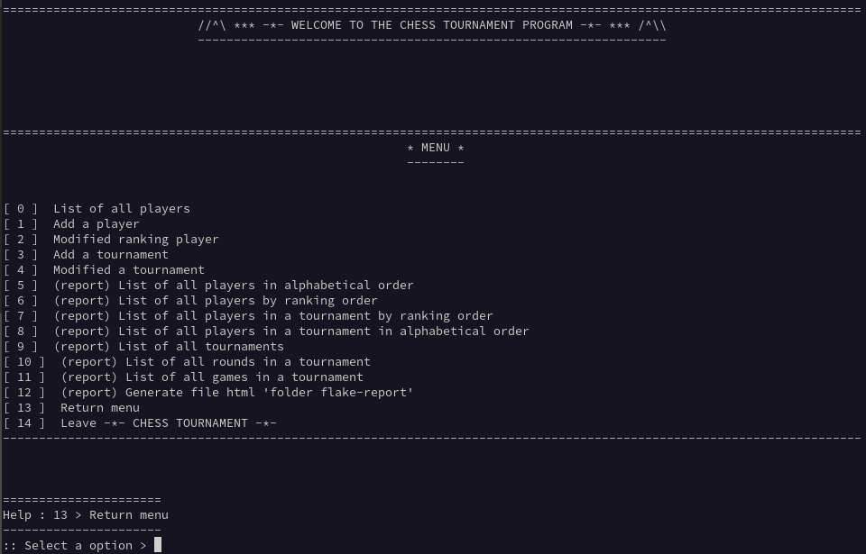

# Chess_Tournament
####
#### Application to help manage weekly chess tournaments.
## Installation & launch
- **Clone the repository**  
`git clone git@github.com:Mike-mg/Chess_Tournament.git`
####
- **Go to the Chess_Tournament folder**
####
- **Creating a working environment**  
`python -m venv env`
####
- **Activate the work environment**  
`source env/bin/activate`
####
- **Installation of the necessary modules**  
`pip install -r requirements.txt`
####
- **To disable the working environment**  
`deactivate`
***
# Running the program
- **Run the program with the following command**  
`./main.py`
####
- **A menu appears, select the desired option  (see below)** 

  
####
- **Menu Options**  
0. Allows to display all the players having participated in a tournament
1. Allows you to add a player
2. Allows you to change the ranking of a player
3. Allows you to create a new tournament
4. Allows you to modify a tournament in progress
5. Displays a report of all players who participated in a tournament (in alphabetical order)
6. Displays a report of all players who participated in a tournament (by ranking)
7. Displays a report of all players in a tournament (by ranking)
8. Displays a report of all players in a tournament (in alphabetical order)
9. Displays a report of all tournaments (name, location, description, start date and end date)
10. Displays a report of all rounds in a tournament
11. Displays a report of all matches in a tournament
12. Displays a report of the correct operation of the program (per module)
13. Back to main menu
14. Quit and save the program 
